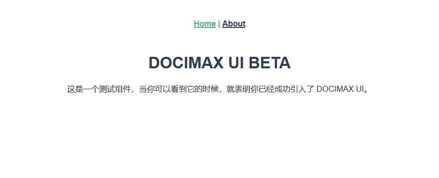

# @docimax/ui

一些需要自己实现的公共基础组件库

## 安装

```bash
npm i @docimax/ui
```

## 引入

```js
import dui from '@docimax/ui';

Vue.use(dui);
```

## 测试

src/views/Home.vue

```js
<template>
  <div class="home">
    <d-wellcome></d-wellcome>
  </div>
</template>

<script>
export default {
  name: 'home',
}
</script>
```

一切顺利的话应该看到此页面

