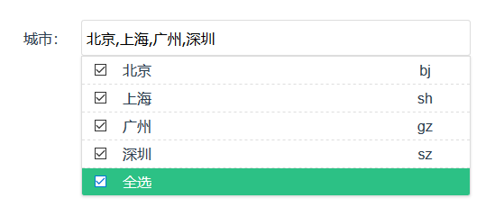

# @docimax/ui

一些需要自己实现的公共基础组件库

## 安装

```bash
npm i @docimax/ui
```

## 引入

```js
import dui from '@docimax/ui';
import '@docimax/ui/lib/dui.css';

Vue.use(dui);
```

## 表单组件

### dui-select



```html
<dui-select v-model="selected" :items="items" mode="multiple"></dui-select>
```

#### Attribute

| name | type | 默认值 | description |
|-|-|-|-|-|
|id|String|duiSelect|也许会用到吧|
|value|Array|[]|当前选中的值的数组|
|items|Array|[]|所有可选项的集合，类型应该是 `{ label: '', value: '' }` 这种结构的|
|mode|String|single|`single` or `multiple` 单选还是多选|
|content|String|label|v-model得到的值, 默认读取 `label` 字段对应值|
|label|String|label|指定使用数据集中的哪个字段作为文案|
|code|String|code|指定使用数据集中的哪个字段作为编码|

#### Event

| name | params | description|
|-|-|-|
|onSelectAllChange|`{ checked: Boolean, value: Array }`|点击全选按钮|
